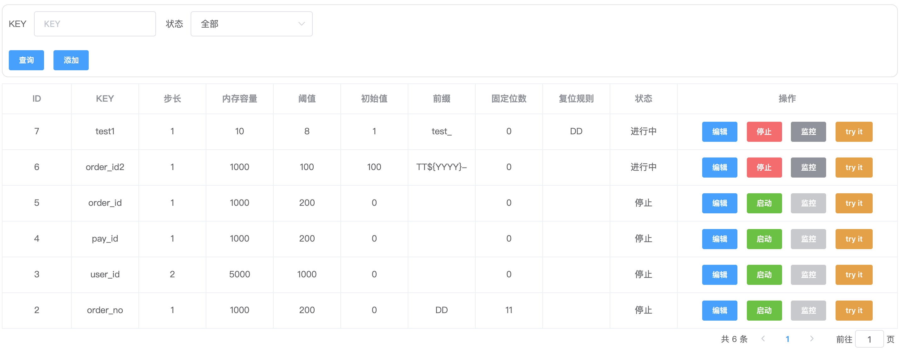
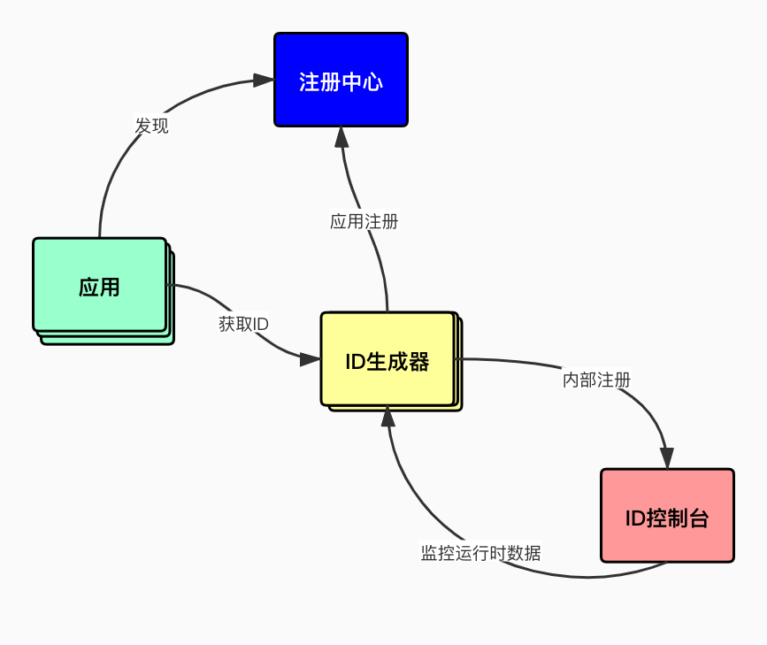
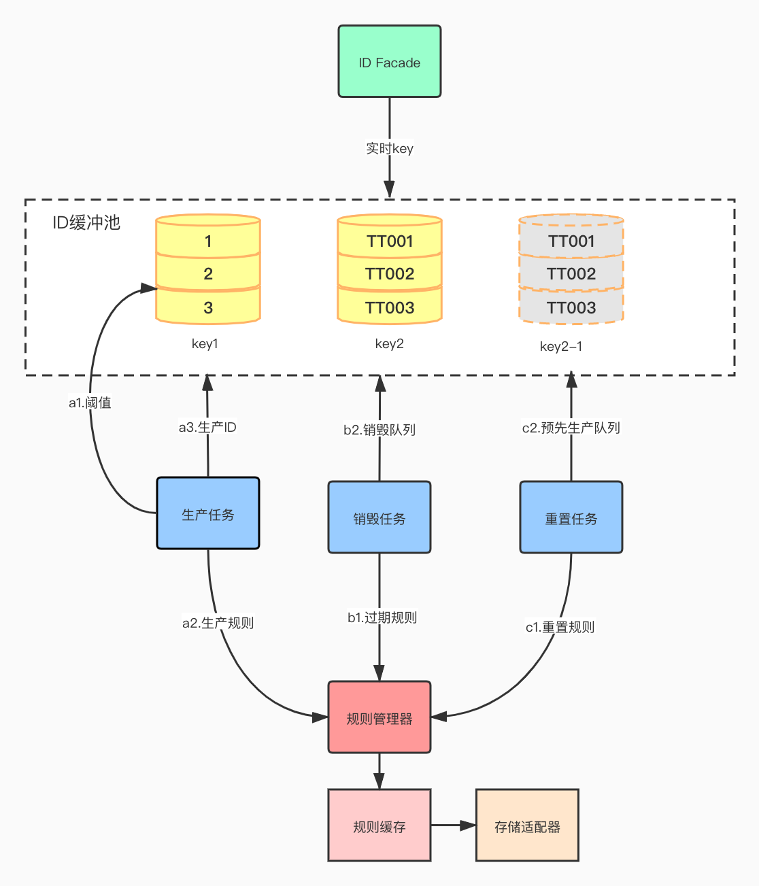

# id-generator 分布式ID生成器

## 概述
id-generator分布式ID生成器, 解决在分布式系统唯一性标识生成复杂、不统一的问题,如数据库分库分表数据唯一标识、业务流水号等场景. id-generator提供一站式部署, 稳定、高性能的ID生成系统.
## 功能
+ 提供全局唯一ID序号；
+ 提供隔离增长序号，以唯一KEY为自增ID标识, 如数据库-表之间的自增id效果；
+ 支持自定义增长步长；
+ 支持固定前缀；
+ 支持[动态标签](./docs/how-to-used.md#动态标签)
+ 支持固定位数；
+ 支持ID重置；
+ 支持[Dubbo](./docs/how-to-used.md#dubbo)、[Spring Cloud](./docs/how-to-used.md#spring-cloud)应用部署；
+ 支持[Mybatis插件](./docs/how-to-used.md#mybatis插件)，可直接插入ID；
+ 支持try it
+ 支持页面[配置](./docs/how-to-used.md#控制台-dashbard)，即时生效；



## 设计
#### 整体依赖关系


+ 支持ZooKeeper、Eureka多种注册中心，满足大部分公司的技术体系
+ 支持HTTP协议，对跨语言提供支持

#### 核心


+ 采用生产/消费模式，预先生成ID存储到缓冲池，调用时ID直接从内存获取，最大提升性能
+ a.缓冲池的队列到达阈值，生产任务开始批量生产ID，规则从规则管理器中获取
+ b.优化缓冲池内存，定时清理过期或被修改缓冲池的队列
+ c.按重置规则，预先生成ID队列至内存，解决临界点瞬时的压力
+ 存储支持MySQL、Redis两种方式，建议使用MySQL

## 快速开始
#### 下载与构建
```bash
git clone https://github.com/haozi2015/id-generator.git
cd id-generator
mvn -DskipTests clean package -P build
```
[更多...](./docs/quick-start.md)

