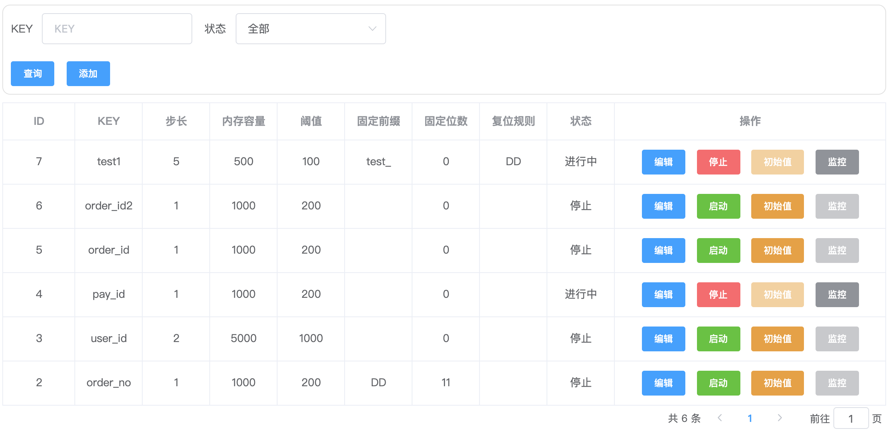
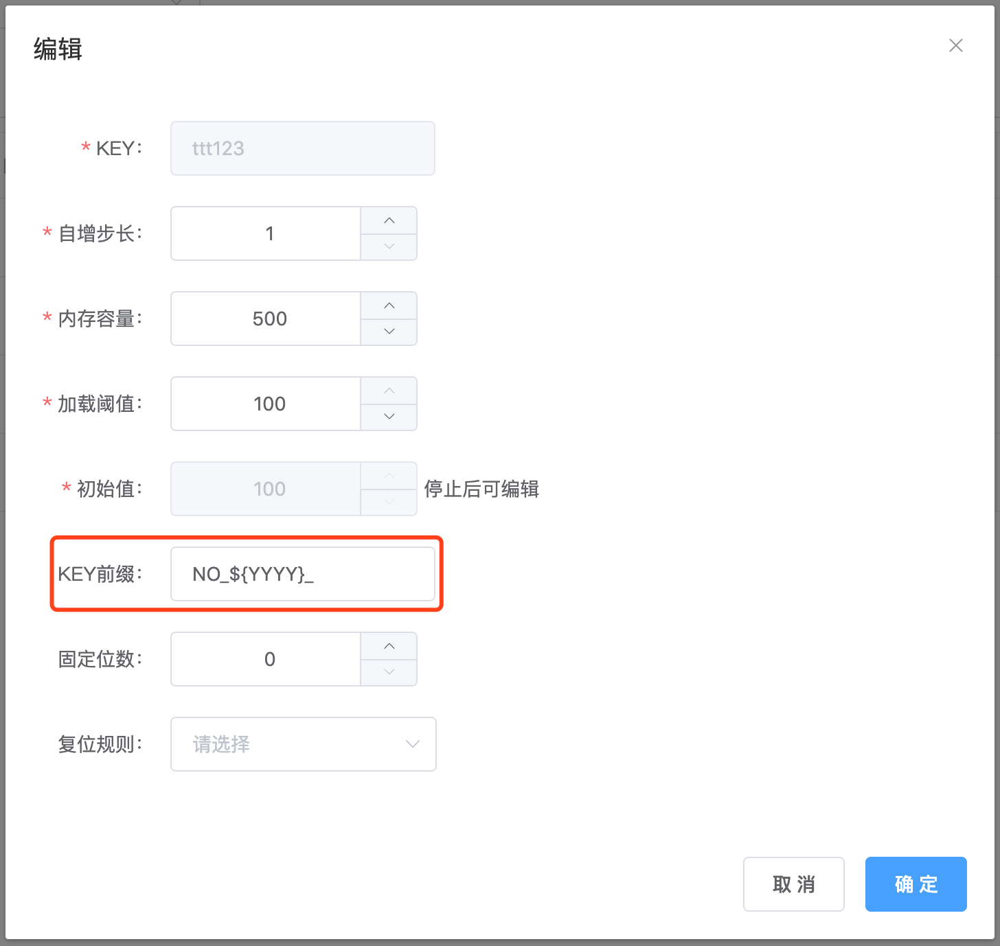

# 如何使用
### 控制台 dashbard


|  列项  |   描述  |是否必填 | 默认值 |
| :----:| :----: | :----: | :----:|
|  KEY  | 隔离自增标识 | 必填，不允许修改 | 无  |
|  步长  | 自增的偏移量 | 非必填         | 1|
|内存容量 |预先加载至内存的ID个数|非必填|500|
|阈值|触发补充ID至内存的阈值|非必填|50|
|前缀|生成ID的前缀|非必填|无|
|固定位数|固定数值部分的位数|非必填|无|
|复位规则|重新开始自增序列|非必填|无|
|状态|表示否是提供ID生成|非必填|停止|

注意：
1. 规则包含前缀或固定位数时，产生的ID值类型为字符串，不包含是为Long类型。
2. 【初始值】设置时，要求必须为`停止`状态
3. 当自增数值超过固定位数时，会越位。如：固定位数为2，当ID值99产生后，下一个ID值为100。


### 客户端使用方式
#### simple
部署id-generator-simple完成。
1. 获取全局唯一ID：
```http request
http://localhost:6080/generate/guid?num=XXX
```
2. 获取隔离自增ID：
```http request
http://localhost:6080/generate/id?key=XXX&num=XXX
```

请求参数

|  列项  |   描述  |是否必填 | 默认值 |
| :----:| :----: | :----: | :----:|
|  key  | 隔离自增标识 | 必填 | 无  |
|  num  | ID个数  |   非必填| 1   |

返回结构：
```json
{
  "code": 0,
  "msg": "",
  "data": [1001,1002],
  "timestamp": 1590111355594
}
```
返回参数

|  列项  |   描述  | 类型 | 默认值 |
| :----:| :----: | :----: | :----:|
|  code  | 状态标识 | 数值 | 0：成功；1：失败  |
|  msg  | 描述  | 字符串  | ""   |
|  data | ID   | 数组    | []|
|  timestamp|当前时间戳| 数值 | |

#### spring cloud
部署id-generator-spring-cloud完成。
1. Feign方式
```java
@FeignClient("id-generator")
public interface IdFeign {
    /**
     * 全局唯一ID
     *
     * @return
     */
    @GetMapping(value = "/generate/guid")
    Response generateGuId();

    /**
     * 全局唯一ID
     *
     * @param num ID个数
     * @return
     */
    @GetMapping(value = "/generate/guid")
    Response generateGuId(@RequestParam("num") int num);

    /**
     * 隔离自增ID
     *
     * @param key 隔离唯一标识
     * @return
     */
    @GetMapping(value = "/generate/id")
    Response generateId(@RequestParam("key") String key);

    /**
     * 隔离自增ID
     *
     * @param key 隔离唯一标识
     * @param num ID个数
     * @return
     */
    @GetMapping(value = "/generate/id")
    Response generateId(@RequestParam("key") String key, @RequestParam("num") int num);

}

```

#### dubbo
maven依赖

```xml
<dependency>
    <groupId>com.haozi</groupId>
    <artifactId>id-generator-dubbo-api</artifactId>
    <version>1.0-SNAPSHOT</version>
</dependency>
```

需手动上传或deploy到maven私服，Jar文件`id-generator-app/id-generator-dubbo/id-generator-dubbo-api/target/`目录

```java
public interface IdGenerator<T> {
    /**
     * 全局唯一ID
     *
     * @return
     */
    Long generateGuid();

    /**
     * 全局唯一ID
     *
     * @param num ID个数
     * @return
     */
    List<Long> generateGuid(int num);

    /**
     * 隔离自增ID
     *
     * @param key 隔离唯一标识
     * @return
     */
    T generateId(String key);

    /**
     * 隔离自增ID
     *
     * @param key 隔离唯一标识
     * @param num ID个数
     * @return
     */
    List<T> generateId(String key, int num);
}

```
其它dubbo配置参考[官网](http://dubbo.apache.org/)。

#### Mybatis插件
maven依赖
```xml
<dependency>
    <groupId>com.haozi</groupId>
    <artifactId>id-generator-mybatis-plugin</artifactId>
    <version>1.0-SNAPSHOT</version>
</dependency>
```
插入insert对象的属性加`@IdField`注解,value值为隔离自增标识key，如：
```java
public class DemoModel {
    @IdField("test1")
    private Long id;

}

```

客户端需配置dubbo或spring cloud方式的依赖和配置。可参考[MybatisPlugin.java](../id-generator-demo/src/main/java/com/haozi/id/generator/demo/plugin/MybatisPlugin.java)

#### 动态标签
支持动态标签,${}方式。



|  列项  |   描述  | 举例 |
| :----:| :----: | :----: |
|  YY  | 年，后两位 | 2021年，取值21 |
|  YYYY | 年  | 2021  | 
|  MM | 月份  | 1~12  | 
|  DD |天| 1～31 | 