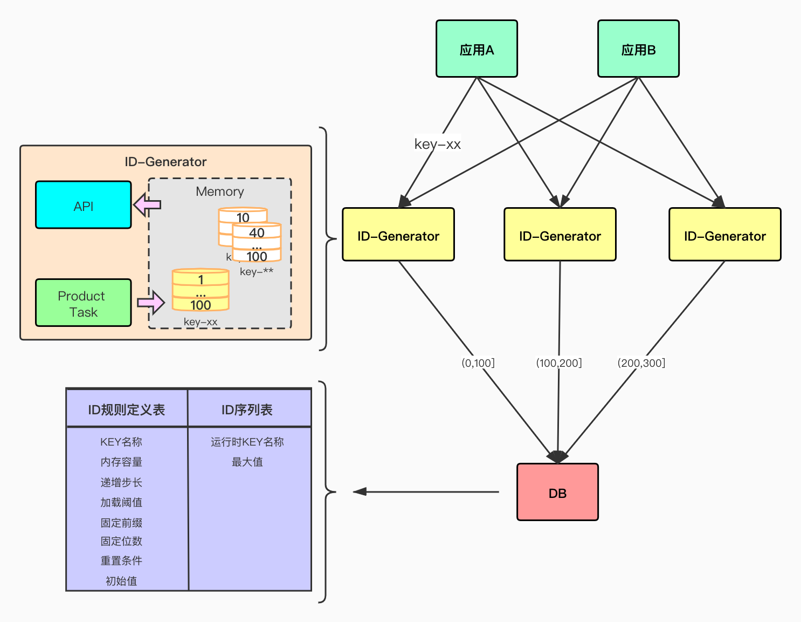
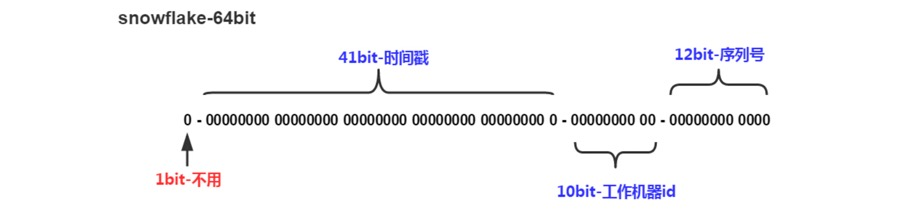
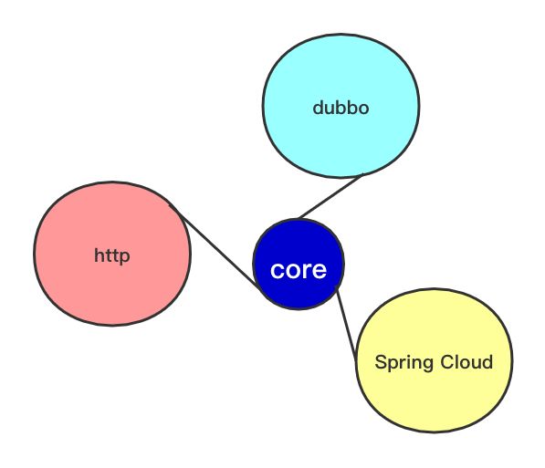
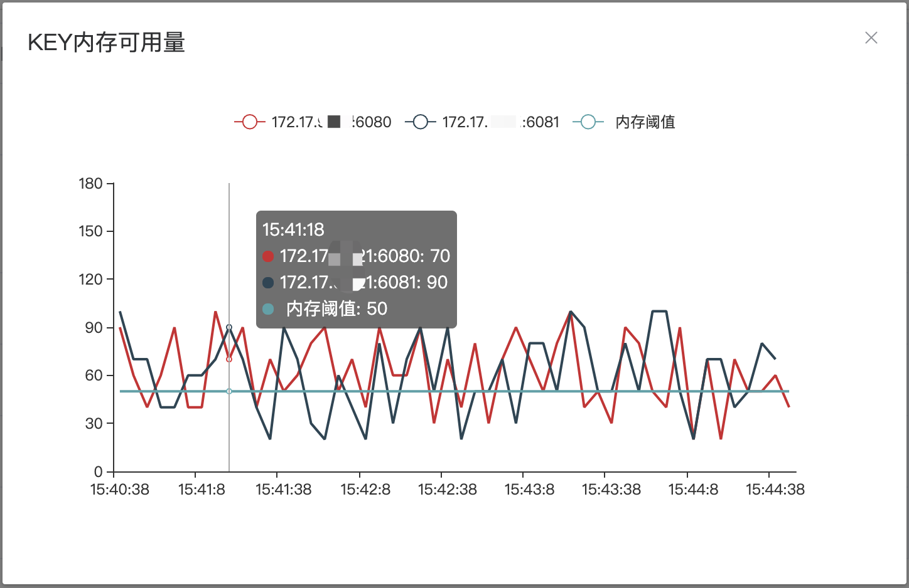

# 分布式ID生成器
## 背景
伴随互联网的发展，无论分布式系统、还是存储都变得更复杂、数据量更大，这些都需要唯一的标识记录。简单举例，数据库原一张表时，通常使用表sequence递增方式，但分库分表后，自带的sequence无法满足，我们需要有一个算法或服务来满足唯一标识的生成。

[寺库](https://www.secoo.com/)，基础设施搭建提出自研唯一ID生成服务，来满足唯一标识的问题。上线后一直运行稳定，2020年初，项目重构并开源，向社区赋能。

## ID-Generator
[ID-Generator](https://github.com/haozi2015/id-generator)分布式ID生成器，解决在分布式系统唯一性标识生成复杂、不统一的问题，如数据库分库分表数据唯一标识、业务流水号、链路跟踪唯一标识等场景。提供一站式部署，稳定、高性能的ID生成系统。
### 功能介绍


+ 提供全局唯一ID序号；
+ 提供隔离增长序号，以唯一KEY为自增ID标识，如数据库-表之间的自增id效果；
+ 支持自定义增长步长；
+ 支持固定前缀；
+ 支持固定位数；
+ 支持ID重置；
+ 支持Dubbo、Spring Cloud应用部署；
+ 支持MyBatis插件，可直接插入ID；
+ 支持try it，查看模拟ID效果；
+ 支持页面配置，即时生效；

### 设计与实现
#### 设计原则
+ 0成本接入，部署即可以使用；
+ 操作简单，页面配置，即时生效；
+ 功能丰富，不仅限于递增序列生成，同时支持各种流水号、前缀、日期、重置等功能；
+ 性能稳定，节点之间无状态，可以根据流量随时扩容；
+ 代码预留扩展，持续集成；

#### 核心设计
[ID-Generator](https://github.com/haozi2015/id-generator)采用业内比较常用内存处理的方式，应用独立部署，提供生成ID能力的服务。服务启动时，先从`存储`中获得ID生成规则和取值范围，再经过计算生成ID值暂时存至内存。其它应用通过参数key，调用ID服务，接口从内存获得ID值。服务`定时`检查内存剩余量，及时向内存补充ID值。



全局唯一ID生成算法基于Twitter开源的Snowflake算法。



+ 1bit-不用：符号位，总是0表示正数，1表示负数，ID都是整数，永为0；
+ 41bit-时间戳：精确到毫秒；
+ 10bit-工作机器id：通常需要依赖zookeeper等三方工具生成机器号，为减少其它依赖，此处使用本机mac地址计算方式，获得1-1024数值；
+ 12bit-序列号：流水号(每1毫秒，每1个节点，可以生产4096个ID，相当于409万TPS。)；

因使用Snowflake算法依赖机器时间，需要注意机器时间回拨问题。

#### 框架
[ID-Generator](https://github.com/haozi2015/id-generator)提供HTTP、Dubbo、Spring Cloud三种应用框架APP，满足大部分公司技术栈，部署即可使用原则。`id-generator-core`核心使用springboot2.1.X最新稳定版；`id-generator-simple`模块提供HTTP协议接口，对多语言支持。



#### 监控
`id-generator-metric`监控模块，使用HTTP协议实现注册/发现功能，监控各ID服务节点，采集ID服务中KEY的内存剩余量，遍于更合理的设置内存容量与阈值。



#### 存储
[ID-Generator](https://github.com/haozi2015/id-generator)支持MySQL和Redis等多种数据存储方式，实现通过配置文件自动适配。配置方式:

```yaml
---
spring:
  datasource:
    driver-class-name: com.mysql.cj.jdbc.Driver
    url: jdbc:mysql://localhost:3306/idgenerator
    username: root
    password: root

#---
# 遵循SpringBoot规则,支持集群模式
#spring:
#  redis:
#    host: 127.0.0.1
#    port: 6379
```

#### 扩展-MyBatis插件
为更易集成，代码更优雅，通过MyBatis插件，实现注解方式自动注入分布式唯一ID。例如:

```Java
//mybatis insert对象
public class DemoModel {
   
    /**
     * 注解实现自动注入，对应key=pay_id的ID值
     */
    @IdField("pay_id")
    private Integer test2;

}
```

[更多...](./how-to-used.md)
### 即将开始
+ client端的SDK模式，开发远程通信模块，不再依赖Dubbo、Spring Cloud框架；
+ server端golang版本；

### 加入我们
+ GitHub：[https://github.com/haozi2015/id-generator](https://github.com/haozi2015/id-generator)
+ ID-Generator交流群：1087376248
+ Owner：[haozi2015](haozi2015@aliyun.com)
